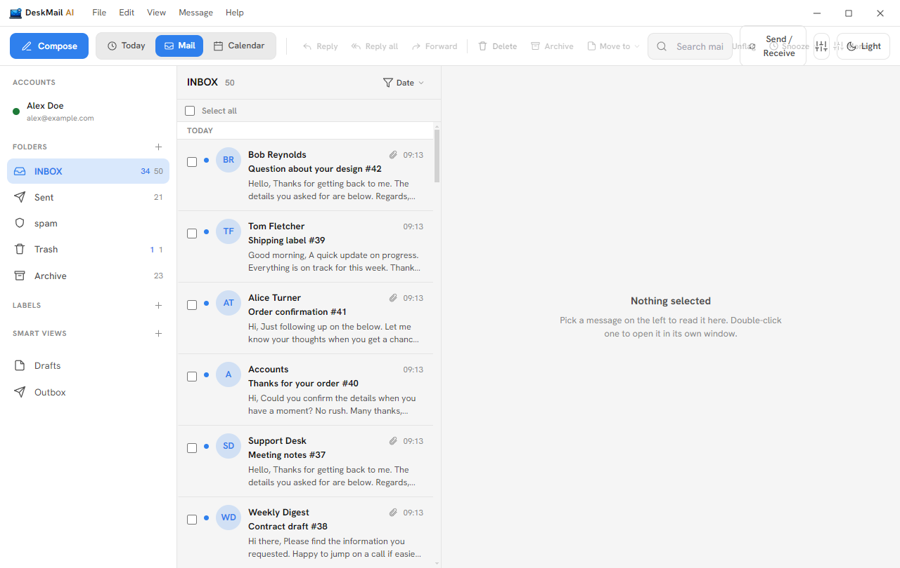
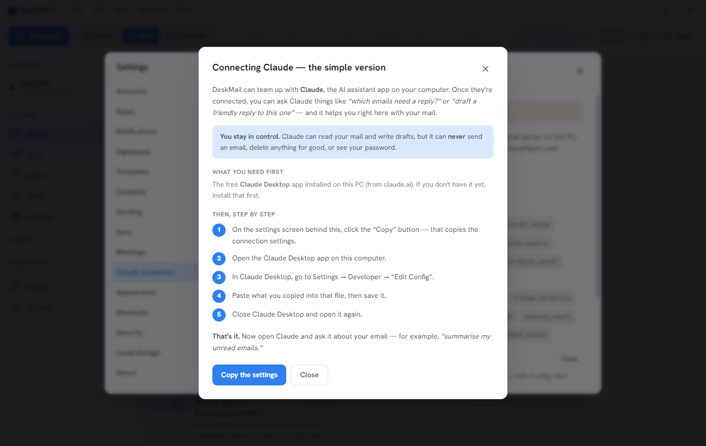
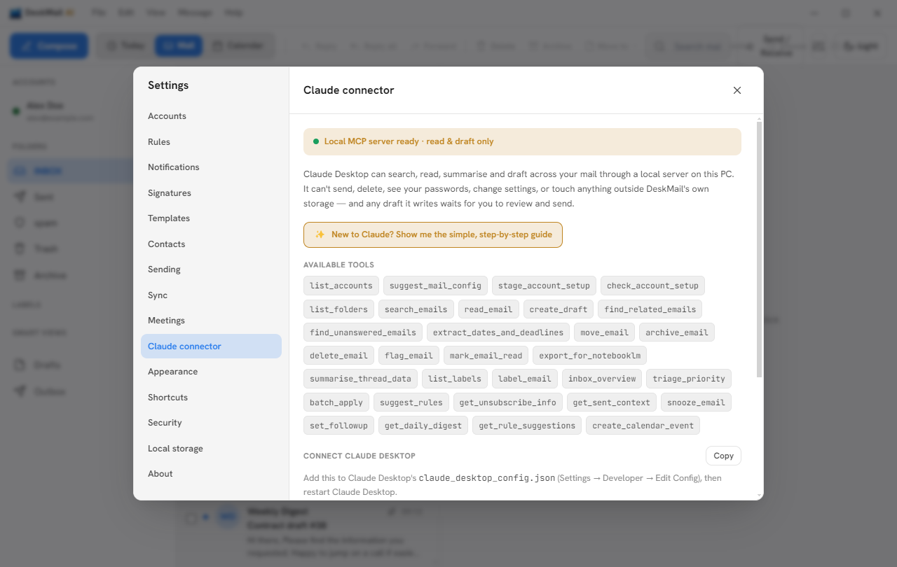

# DeskMail AI

A **local, single-user desktop email client for Windows** with a safe, built-in
Claude connector. Your mail is fetched from your own mail server and cached in a
local database on your PC; your password is encrypted by Windows. Nothing leaves
your machine except the connection to your own mail server and — only if you
choose — your own Claude.



> ### 👋 New to coding, Claude, or AI in general?
> This README is written for people who are comfortable with a terminal. **If that's
> not you, don't worry** — scroll down to **[For people new to all this](#for-people-new-to-all-this)**
> near the bottom. It explains what this is and how to run it in plain language, with
> no assumed knowledge.

---

## What it does

- Full **IMAP/SMTP** email: every folder, deep history, instant new-mail push (IDLE),
  two-way sync of reads/flags/moves/deletes.
- **Reading & organising**: folders, labels, pin/mute, snooze, follow-ups, rules,
  a learning junk filter, smart views, and an optional focused inbox.
- **Composing**: rich text, attachments, multiple signatures, templates, drafts,
  scheduled send, and undo-send.
- **Calendar & contacts**, search, an attachments browser, backup/restore.
- A **local Claude (MCP) connector** that can read, search, draft, and organise your
  mail — but **can never send, permanently delete, or read your password**. It can
  even **set up a mail account for you** (see below).

A full list is in **[FEATURES.md](FEATURES.md)**. What's been tested and the known
limitations are in **[TESTING_AND_LIMITATIONS.md](TESTING_AND_LIMITATIONS.md)**.

---

## Quick start

**The easy way (no coding):** download the Windows installer from the
[Releases](../../releases) page, run it, and click **"More info" → "Run anyway"** past
the "unknown publisher" warning (it's unsigned — normal for a free app). Then open
DeskMail and add your email account.

**From source (developers):**

**Prerequisites:** Windows 10/11, [Node.js](https://nodejs.org/) 20+ and Git.

```bash
git clone <your-fork-url>
cd "DeskMail AI"
npm install
npm run dev          # launch the app with hot reload
```

Other commands:

```bash
npm test             # unit tests
npm run test:e2e     # end-to-end tests (builds + drives the app)
npm run build        # production build into out/
npm run package      # build the Windows installer into release/
```

> **Install note:** this project avoids native compilation — `electron` is a plain
> download and the database is WebAssembly SQLite (`node-sqlite3-wasm`), so no build
> tools are required.

---

## Connect Claude Desktop (the local MCP connector)

This is the headline feature: connect DeskMail to the **Claude Desktop** app so Claude
can help with your email — read it, search it, summarise it, draft replies, tidy it,
and even set up accounts. It runs through a **local server on your PC** and is
deliberately **read-and-draft only**: it can **never send mail, permanently delete
anything, read your password, change settings, or touch files outside DeskMail**. Any
draft it writes waits in your Drafts for you to review and send.

> **New to this?** DeskMail has a built-in, plain-English walkthrough — open
> **Settings → Claude connector** and click **"✨ New to Claude? Show me the simple,
> step-by-step guide"**:
>
> 

### What you need first
The free **Claude Desktop** app installed on the same PC — download it from
[claude.ai/download](https://claude.ai/download). And run DeskMail at least once so its
local database exists.

### Step by step

**1. In DeskMail, open Settings → Claude connector** and click **Copy**. This copies a
small configuration block with the exact paths for your machine.



**2. In Claude Desktop, open the config file.** Go to **Settings → Developer → Edit
Config**. That opens a file called `claude_desktop_config.json` in your text editor.

**3. Paste in the DeskMail block.** The block you copied looks like this (your paths
will differ — always copy the real one from the app rather than typing it):

```json
{
  "mcpServers": {
    "deskmail-ai": {
      "command": "C:\\Program Files\\DeskMail AI\\DeskMail AI.exe",
      "args": ["C:\\Program Files\\DeskMail AI\\resources\\app\\out\\main\\mcp-server.js"],
      "env": {
        "ELECTRON_RUN_AS_NODE": "1",
        "DESKMAIL_DB": "C:\\Users\\you\\AppData\\Roaming\\deskmail-ai\\deskmail.db"
      }
    }
  }
}
```

> **If the file already has other servers:** it will already contain an `"mcpServers"`
> section. Don't paste a second one — just add the `"deskmail-ai": { … }` entry
> *inside* the existing `mcpServers` object, and make sure the commas and braces still
> line up (it must stay valid JSON).

**4. Save the file.**

**5. Fully quit and reopen Claude Desktop** (quit it completely, not just close the
window, then start it again).

**6. Check it worked.** In a Claude Desktop chat you should now be able to use DeskMail's
tools. Try asking: *"Using DeskMail, summarise my unread emails."* Claude will read your
mail through the connector and answer.

### It launches via DeskMail itself
The config runs DeskMail's own binary in Node mode (`ELECTRON_RUN_AS_NODE=1`) so you
**don't need a separate Node.js install**, and points it at your local `deskmail.db`
via `DESKMAIL_DB`. Nothing about your mail leaves your PC.

### Have Claude set up an email account for you
Once connected, you can ask Claude Desktop, e.g. *"set up my iCloud email in DeskMail."*
Claude looks up the right server settings, fills in the Add-account form in the app for
you, and tells you to type your password, run the connection test, and save. **Claude
never asks for or sees your password** — you enter only that.

### Troubleshooting
- **Tools don't show up in Claude Desktop?** Check the config is valid JSON (a missing
  comma or brace will stop it loading), then fully quit and reopen Claude Desktop.
- **Make sure DeskMail has been run at least once** so its database exists at the path
  in `DESKMAIL_DB`.
- Re-copy the config from **Settings → Claude connector → Copy** if you moved or
  reinstalled DeskMail (the paths change).

---

## Make it yours

The whole point of this app is that you can change it with Claude. See
**[docs/CUSTOMISING_WITH_CLAUDE.md](docs/CUSTOMISING_WITH_CLAUDE.md)** for worked
examples ("give it a dark-blue theme", "add a shortcut to archive", "change the
reading pane"), each written as *what to type to Claude* and *how to see it working*.

If you're editing the code with Claude Code, the root **[CLAUDE.md](CLAUDE.md)** tells
Claude how the app is put together and the rules to follow.

---

## Licence

**Apache License 2.0** — see [LICENSE](LICENSE).

In plain English: **free and open.** You can use it, read the code, change it, share
it, fork it, and build your own version — all you have to do is keep the copyright
notice and the licence with it. You're welcome to keep the "DeskMail AI" name or rename
your fork, whichever you prefer. If you improve it, please do share what you did — that's
the whole idea.

Third-party dependency licences are in [THIRD_PARTY_LICENSES.md](THIRD_PARTY_LICENSES.md).

**No warranty.** This software touches your mail and passwords. It comes **as-is, with
no warranty**, and the author is **not liable** for any loss or damage from using it.
Use at your own risk, and keep your own backups. See [SECURITY.md](SECURITY.md) for the
honest threat model.

---

## For people new to all this

If words like "terminal", "repo", "Node" or "MCP" mean nothing to you, this section is
for you. Nothing here assumes you can code.

**What is DeskMail AI?**
It's an email program you run on your own Windows computer — like Outlook or the Mail
app, but it keeps your emails on *your* machine and lets an AI assistant (Claude) help
you with them safely.

**Why would I want it?**
- Your email stays private, on your computer. It doesn't phone home.
- Claude can read and tidy your mail and write draft replies for you — but it can
  **never** send anything or delete anything for good on its own. You're always in
  control.
- You can change how it looks and works just by *asking Claude*, even if you've never
  written a line of code.

**What is Claude / Claude Desktop / Claude Code?**
Claude is an AI assistant made by Anthropic. "Claude Desktop" is the Claude app you
install on your computer. "Claude Code" is a version that can edit files and code for
you. DeskMail can connect to either so the AI can help with your email or change the app.

**What is an "app password"?**
Big email providers (Gmail, iCloud, Outlook, Yahoo) often won't let another app log in
with your normal password for safety. Instead you create a special one-time "app
password" in your email account's security settings and use that. It's like cutting a
spare key that only works for one gadget. If you ask Claude to set your account up, it
will tell you when you need one and where to get it.

**How do I actually get it running?**
The easiest way, if you don't code:
1. Go to the **Releases** page of this project (the link is near the top of this page).
2. Download the Windows installer (a file ending in `.exe`).
3. Run it. Windows may warn that the publisher is unknown — that's expected for a free
   app like this; choose "More info" → "Run anyway" if you're comfortable.
4. Open DeskMail, and either add your email by hand or ask Claude to set it up for you.
5. To let Claude help with your mail, follow **[Connect Claude Desktop](#connect-claude-desktop-the-local-mcp-connector)**
   above — and if a step is confusing, the app's own **"New to Claude?"** guide walks
   you through it, or paste the step into Claude and ask it to help.

**Is it safe?**
Your mail and password stay on your PC. The one honest caveat: the local copy of your
mail is **not encrypted on disk** (your password is), so treat your Windows account as
the lock on the door. More detail is in [SECURITY.md](SECURITY.md).
